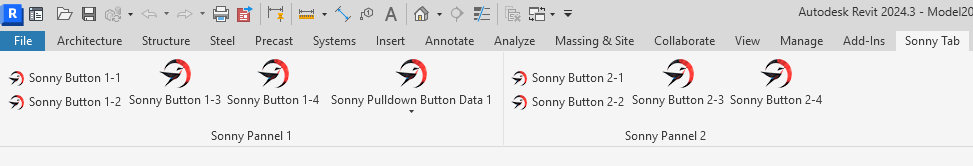
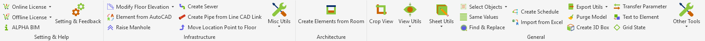
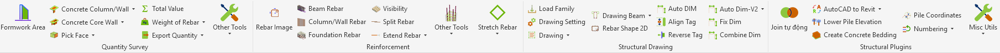

# EasyRibbon

A powerful and elegant attribute-based framework for creating Revit Ribbon UI with minimal code. Build beautiful Revit add-in interfaces using simple C# attributes instead of verbose Revit API calls.

This project was inspired by the concept/idea from my company where I work. However, all the code in this repository is written entirely by me from scratch, with my own implementation, improvements, and new features to create this open-source framework.



Example AlphaBIM Tool





## ✨ Features

- 🎯 **Attribute-Based UI Definition** - Define your ribbon UI using simple C# attributes
- 🌐 **Resource-Based Localization** - Support for localized strings via ResourceDictionary
- 🧩 **Modular Architecture** - Organize multiple add-ins into independent, reusable modules
- 🔄 **Multi-Version Support** - Supports Revit 2021 to 2026
- 🐛 **Easy Debugging** - Debug individual modules separately or all together
- 📦 **Flexible Deployment** - Load all modules together or deploy them independently
- 🎨 **Rich UI Components** - Support for buttons, stacked buttons, pulldown buttons, and nested combinations

## 🚀 Quick Start

### Installation

1. Clone the repository:
```bash
git clone https://github.com/PhanCongVuDuc/EasyRibbon.git
```

2. Build the solution in Visual Studio

3. Reference `EasyRibbon.dll` in your Revit add-in project

### Basic Usage

#### 1. Define Your Ribbon UI with Attributes

```csharp
using EasyRibbon.UIAttributeBase;

[Tab("My Tools")]
public class MyToolsTab
{
    [Panel("Design Tools")]
    public class DesignPanel
    {
        [Button("Column Rebar",
            typeof(ColumnRebarCommand),
            Image = "/MyAddin;component/Resources/Icons/icon16.png",
            LargeImage = "/MyAddin;component/Resources/Icons/icon32.png",
            ToolTip = "Generate column reinforcement")]
        public class ColumnRebarButton;

        [Button("Beam Design",
            typeof(BeamDesignCommand),
            Image = "/MyAddin;component/Resources/Icons/beam16.png",
            LargeImage = "/MyAddin;component/Resources/Icons/beam32.png")]
        public class BeamDesignButton;
    }
}
```

#### 2. Create Your Module

```csharp
using EasyRibbon.Modules;
using Autodesk.Revit.UI;

public class MyModule : IApplicationModule
{
    public string ModuleName => "My Custom Module";
    
    public void OnStartup(UIControlledApplication application)
    {
        CreateUIApp.CreateUI<MyToolsTab>(application);
    }
    
    public void OnShutdown(UIControlledApplication application)
    {
        // Cleanup if needed
    }
}
```

#### 3. Create Application Entry Point

```csharp
using Nice3point.Revit.Toolkit.External;

public class Application : ExternalApplication
{
    private readonly MyModule _module = new MyModule();
    
    public override void OnStartup()
    {
        _module.OnStartup(Application);
    }
    
    public override void OnShutdown()
    {
        _module.OnShutdown(Application);
    }
}
```

That's it! 🎉 No more verbose Revit API calls for creating ribbon UI.

## 📖 Documentation

### Supported Attributes

#### Tab Attribute
```csharp
[Tab("Tab Name")]
public class MyTab { }
```

#### Panel Attribute
```csharp
[Panel("Panel Name")]
public class MyPanel { }
```

#### Button Attribute
```csharp
[Button("Button Text",
    typeof(CommandClass),
    Image = "path/to/16x16.png",
    LargeImage = "path/to/32x32.png",
    ToolTip = "Tooltip text",
    LongDescription = "Detailed description",
    ToolTipImage = "path/to/tooltip.png",
    ContextualHelp = "https://help-url.com")]
public class MyButton;

// With resource-based localization
[Button("Fallback Name",
    typeof(CommandClass),
    NameKey = "Button.MyButton",           // Resolve from ResourceDictionary
    ToolTipKey = "ToolTip.MyButton",       // Resolve tooltip from ResourceDictionary
    ToolTipDefault = "Fallback tooltip",   // Fallback if resource not found
    Image = "path/to/16x16.png",
    LargeImage = "path/to/32x32.png")]
public class MyLocalizedButton;
```

#### Stacked Button Attribute
```csharp
[StackedButton("Stacked Button Name")]
public class MyStackedButtons
{
    [Button("Button 1", typeof(Command1), ...)]
    public class Button1;
    
    [Button("Button 2", typeof(Command2), ...)]
    public class Button2;
    
    [Button("Button 3", typeof(Command3), ...)]
    public class Button3;
}

// Stacked buttons can also contain pulldown buttons
[StackedButton("Stacked with Pulldown")]
public class MyMixedStackedButtons
{
    [Button("Button 1", typeof(Command1), ...)]
    public class Button1;
    
    [Button("Button 2", typeof(Command2), ...)]
    public class Button2;
    
    [PulldownButtonData("Pulldown Name", ...)]
    public class MyPulldown
    {
        [Button("Option 1", typeof(Command3), ...)]
        public class Option1;
        
        [Button("Option 2", typeof(Command4), ...)]
        public class Option2;
    }
}
```

#### Pulldown Button Attribute
```csharp
[PulldownButtonData("Pulldown Name",
    Image = "path/to/16x16.png",
    LargeImage = "path/to/32x32.png")]
public class MyPulldown
{
    [Button("Option 1", typeof(Command1), ...)]
    public class Option1;
    
    [Button("Option 2", typeof(Command2), ...)]
    public class Option2;
}

// With resource-based localization
[PulldownButtonData("Fallback Name",
    NameKey = "Pulldown.MyPulldown",
    ToolTipKey = "ToolTip.MyPulldown",
    ToolTipDefault = "Fallback tooltip",
    Image = "path/to/16x16.png",
    LargeImage = "path/to/32x32.png")]
public class MyLocalizedPulldown
{
    [Button("Fallback Option", typeof(Command1), NameKey = "Button.Option1", ...)]
    public class Option1;
}
```

### Resource-Based Localization

EasyRibbon supports localized strings through WPF ResourceDictionary. This allows you to:
- Centralize all UI strings in XAML resource files
- Support multiple languages easily
- Provide fallback values when resources are not found

#### Setting Up Resources

1. Create a ResourceDictionary file (e.g., `Resources/Strings.xaml`):

```xml
<ResourceDictionary xmlns="http://schemas.microsoft.com/winfx/2006/xaml/presentation"
                    xmlns:x="http://schemas.microsoft.com/winfx/2006/xaml"
                    xmlns:system="clr-namespace:System;assembly=mscorlib">
    
    <!-- Tab Names -->
    <system:String x:Key="Tab.MyTab">My Tab</system:String>
    
    <!-- Panel Names -->
    <system:String x:Key="Panel.MyPanel">My Panel</system:String>
    
    <!-- Button Names -->
    <system:String x:Key="Button.MyButton">My Button</system:String>
    
    <!-- ToolTips -->
    <system:String x:Key="ToolTip.MyButton">This is my button</system:String>
</ResourceDictionary>
```

2. Load ResourceDictionary in your module:

```csharp
public void OnStartup(UIControlledApplication application)
{
    // Load ResourceDictionary for resource-based names
    LoadResourceDictionary();
    
    // Create ribbon UI
    CreateUIApp.CreateUI<MyToolsTab>(application);
}

private static void LoadResourceDictionary()
{
    // Ensure Application.Current exists
    if (System.Windows.Application.Current == null)
    {
        new System.Windows.Application { ShutdownMode = ShutdownMode.OnExplicitShutdown };
    }

    if (System.Windows.Application.Current == null)
        return;

    var resourceDictionary = new ResourceDictionary
    {
        Source = new Uri("/MyAddin;component/Resources/Strings.xaml",
            UriKind.RelativeOrAbsolute)
    };

    System.Windows.Application.Current.Resources.MergedDictionaries.Add(resourceDictionary);
}
```

3. Use `NameKey` and `ToolTipKey` in your attributes:

```csharp
[Tab("Fallback Tab Name", NameKey = "Tab.MyTab")]
public class MyTab
{
    [Panel("Fallback Panel Name", NameKey = "Panel.MyPanel")]
    public class MyPanel
    {
        [Button("Fallback Button Name",
            typeof(MyCommand),
            NameKey = "Button.MyButton",
            ToolTipKey = "ToolTip.MyButton",
            ToolTipDefault = "Fallback tooltip",
            Image = "/MyAddin;component/Resources/Icons/icon16.png",
            LargeImage = "/MyAddin;component/Resources/Icons/icon32.png")]
        public class MyButton;
    }
}
```

**How it works:**
- If `NameKey` exists in ResourceDictionary → uses the resource value
- If `NameKey` not found → falls back to `Name` parameter
- Same logic applies to `ToolTipKey` → `ToolTipDefault` → `ToolTip`

### Module System

The module system allows you to organize multiple Revit add-ins into independent modules that can be loaded together or separately.

#### Benefits

✅ **Separation of Concerns** - Each module is independent  
✅ **Easy Testing** - Debug individual modules separately  
✅ **Flexible Deployment** - Load all modules or specific ones  
✅ **Clean Code** - Clear structure and organization  
✅ **Error Isolation** - One module failure doesn't affect others

#### Master Application (Load All Modules)

```csharp
public class MasterApplication : ExternalApplication
{
    private readonly ModuleRegistry _moduleRegistry = new ModuleRegistry();
    
    public override void OnStartup()
    {
        // Register modules
        _moduleRegistry.RegisterModule<Module1>();
        _moduleRegistry.RegisterModule<Module2>();
        _moduleRegistry.RegisterModule<Module3>();
        
        // Initialize all
        _moduleRegistry.InitializeAll(Application);
    }
    
    public override void OnShutdown()
    {
        _moduleRegistry.ShutdownAll(Application);
    }
}
```

## 🏗️ Project Structure

```
EasyRibbon/
├── EasyRibbon/                     # Core library
│   ├── UIAttributeBase/            # Attribute definitions
│   ├── Extensions/                 # Helper extensions
│   ├── Modules/                    # Module system
│   └── CreateUIApp.cs              # Main UI builder
├── EasyRibbonExample/              # Single module example
│   ├── Application.cs              # Standalone entry point
│   ├── ExampleModule.cs            # Module implementation
│   └── SonnyTab1.cs                # UI definition
└── EasyRibbonMasterExample/        # Multi-module example
    └── Application.cs              # Master application
```

## 🔧 Requirements

- Visual Studio or Rider
- Autodesk Revit 2021 to 2026
- [Nice3point.Revit.Toolkit](https://github.com/Nice3point/RevitToolkit)

## 📦 Dependencies

- Nice3point.Revit.Toolkit
- Nice3point.Revit.Extensions

## 🎯 Examples

Check out the included example projects:

1. **EasyRibbonExample** - Single module with multiple tabs and panels
   - `SonnyTab1.cs` - Basic buttons and stacked buttons
   - `SonnyTab2.cs` - More stacked button examples
   - `SonnyTab3.cs` - Pulldown button examples
   - `SonnyTab4.cs` - **Stacked buttons with pulldown button and resource-based localization**
   - `Resources/Strings.xaml` - ResourceDictionary example for localization
2. **EasyRibbonMasterExample** - Master application loading multiple modules

Run the examples to see the framework in action!

## 🤝 Contributing

Contributions are welcome! Please feel free to submit a Pull Request.

1. Fork the repository
2. Create your feature branch (`git checkout -b feature/AmazingFeature`)
3. Commit your changes (`git commit -m 'Add some AmazingFeature'`)
4. Push to the branch (`git push origin feature/AmazingFeature`)
5. Open a Pull Request

## 📝 License

This project is licensed under the MIT License - see the [LICENSE](LICENSE) file for details.

## 🙏 Acknowledgments

- My company - For the original concept/idea that inspired this framework (all code written by me)
- [Nice3point](https://github.com/Nice3point) for the excellent Revit Toolkit
- The Revit API community for inspiration and support

## 📧 Contact

If you have any questions or suggestions, please open an issue on GitHub.

## ⭐ Star History

If you find this project useful, please consider giving it a star! ⭐

---

**Happy Coding!** 🚀

